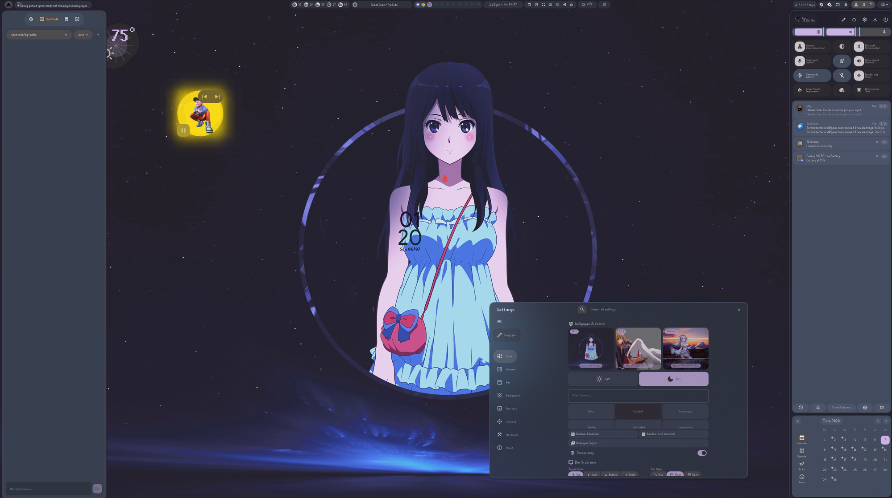
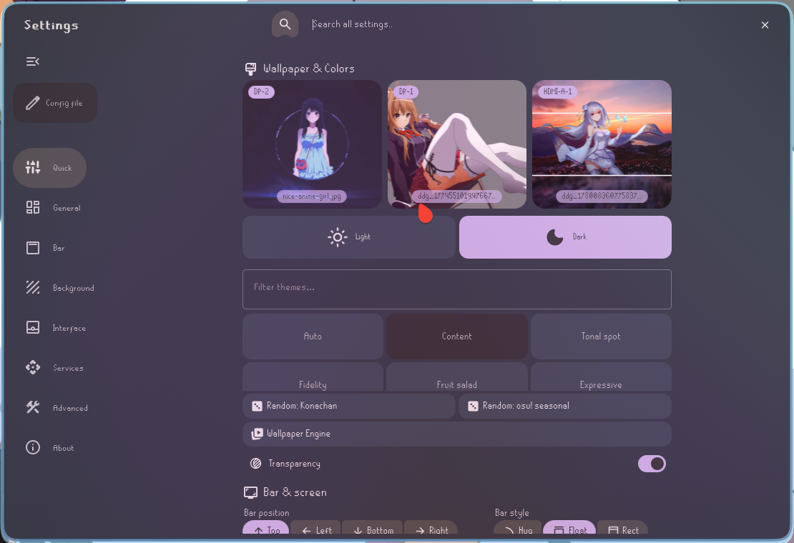
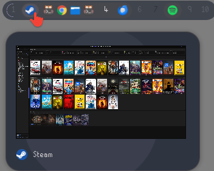
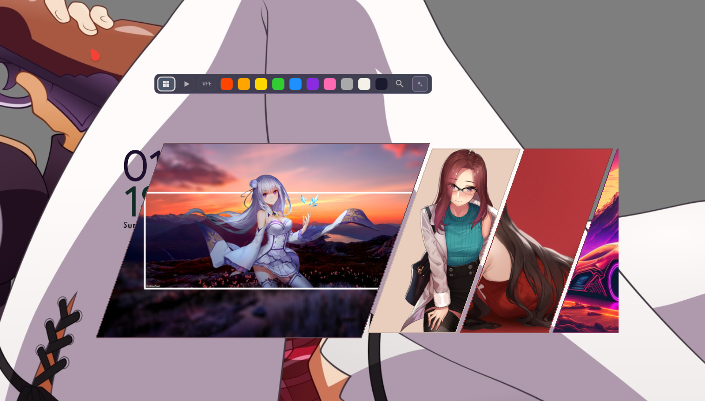

# ii-lacuna

A fork of [illogical-impulse](https://github.com/end-4/dots-hyprland) — Hyprland + Quickshell desktop with Material You theming, a built-in settings GUI, and a one-command install.



---

## What's included

- **Material You theming** — change your wallpaper, everything recolors automatically (shell, GTK, Qt, Discord, Hyprland borders)
- **Settings GUI** — no config file editing required for common tweaks
- **Per-monitor wallpapers** — pick a different wallpaper for each display
- **Music player** — album art widget with playback controls
- **Notifications sidebar** — persistent history + popup toasts
- **Workspace overview** — visual switcher with inline wallpaper picker
- **App thumbnail taskbar** — hover an app, see a live preview
- **System widgets** — updates, weather, calendar, clock
- **vynx CLI** — manage, restart, and update the shell from the terminal
- **Google Calendar sync** — optional, one script setup

| Settings | Taskbar | Overview |
|----------|---------|----------|
|  |  |  |

---

## Requirements

- Arch Linux (or Arch-based — CachyOS, EndeavourOS, etc.)
- [Hyprland](https://hyprland.org/)
- [illogical-impulse](https://github.com/end-4/dots-hyprland) installed first (base dots)
- `quickshell`, `matugen`, `lua`

---

## Install

```bash
git clone https://github.com/surprizeattackxx-dotcom/ii-lacuna.git
cd ii-lacuna
bash setup-ii-lacuna.sh
```

That's it. The script will:
1. Pull the latest changes
2. Back up your existing Quickshell config
3. Symlink the new configs
4. Restart Hyprland + Quickshell

### Full install (no existing dots)

If you haven't installed illogical-impulse yet:

```bash
bash setup-ii-lacuna.sh --full-install
```

### Flags

| Flag | What it does |
|------|-------------|
| `--no-pull` | Skip git pull |
| `--no-backup` | Overwrite without backing up |
| `--force-install` | Skip illogical-impulse check |
| `--no-confirm` | No prompts, just go |
| `-v` | Verbose output |

---

## Updating

```bash
cd ii-lacuna && git pull && bash setup-ii-lacuna.sh --no-confirm
```

---

## Google Calendar

```bash
bash setup-google-calendar.sh
```

---

## Issues / Contributing

- [Bug reports & feature requests](https://github.com/surprizeattackxx-dotcom/ii-lacuna/issues)
- PRs welcome

---

> Based on [end-4/dots-hyprland](https://github.com/end-4/dots-hyprland). See [licenses/](licenses/) for attribution.
